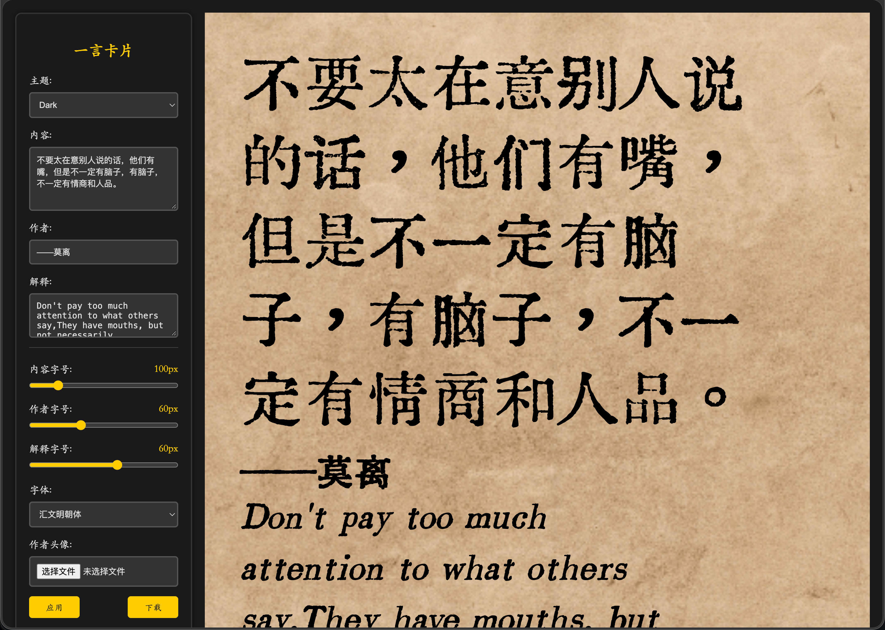

# RetroCard

RetroCard 是一个基于 Vue 3 和 Vite 的仿古卡片生成器。你可以自定义卡片主题、文字、字体、字号和头像，并将生成结果导出为图片。

## 预览



## 功能

- 选择不同的卡片主题
- 编辑作者、正文和英文释义
- 调整字体与字号
- 上传作者头像
- 将卡片导出为图片

## 本地开发

```bash
npm install
npm run dev
```

开发服务器启动后，打开终端中显示的本地地址即可预览。

## 构建预览

```bash
npm run build
npm run preview
```

## GitHub Pages 部署

仓库已经配置 GitHub Actions。将代码推送到 `main` 分支后，工作流会自动安装依赖、构建项目并发布到 GitHub Pages。

首次使用时，请在仓库的 **Settings > Pages** 中将 **Source** 设置为 **GitHub Actions**。部署完成后，页面地址通常为：

```text
https://<用户名>.github.io/<仓库名>/
```

## 项目结构

```text
.
├── .github/workflows/deploy.yml  # GitHub Pages 自动部署
├── public/                       # 静态资源
├── src/
│   ├── components/               # 卡片与设置面板组件
│   ├── App.vue
│   └── main.js
├── index.html
├── styles.css
├── package.json
└── vite.config.js
```

## 相关项目

- [仿古卡片生成](https://retro.iwhy.dev)
- [slogan.ishell.online](https://slogan.ishell.online)
- [提示词语法高亮](https://show.langgpt.ai)
- [字幕截图生成器](https://vtool.pro/subtitle/index.html)

## 许可证

本项目使用 [MIT License](LICENSE)。
